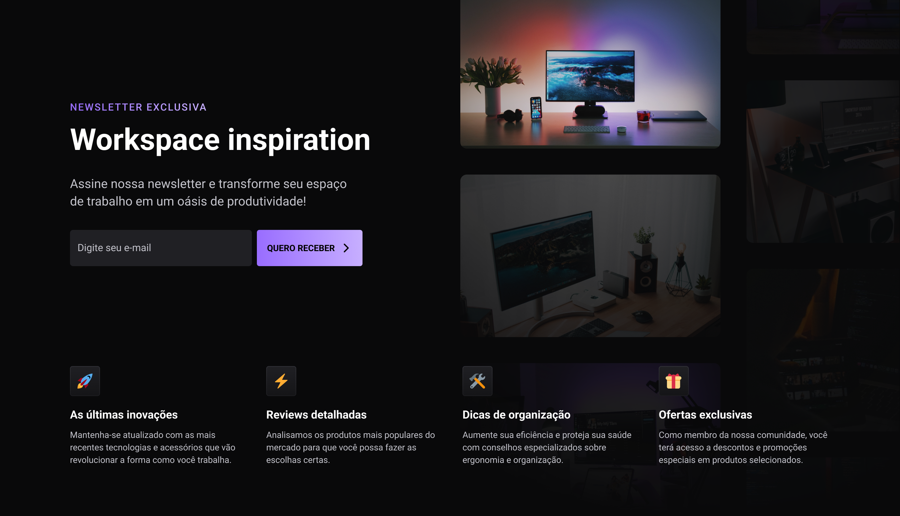

# Newsletter - boraCodar 40

Página de inscrição de uma newsletter.

## Executando o projeto

Abaixo seguem as instruções para você executar o projeto na sua máquina.

Comece clonando o repositório e instalando suas dependências:

```sh
git clone https://github.com/hlgboot/letscode40-newsletter
cd letscode40-newsletter
npm install
```

### Back-end

O back-end desse projeto é construído em Node.js, mais especificamente sua versão LTS.

Além do Node.js, foi utilizado a biblioteca de envio de e-mails Nodemailer e o serviço de autenticação OAuth2.

Após clonar o repositório, é necessário configurar as chaves de acesso ao GMAIL em api/.env.

```sh
# Entrar na pasta da API
cd api
```

```sh
# Configurar as variáveis ambiente para o acesso ao GMAIL com OAuht2 em api/.env

MAIL_USERNAME="yourusername"
MAIL_PASSWORD="yourpassword"

OAUTH_CLIENTID="yourclientid"
OAUTH_CLIENT_SECRET="yourclientsecret"
OAUTH_REFRESH_TOKEN="yourrefreshtoken"
```

```sh
# Subir o servidor HTTP
npm run dev
```

### Web

Para executar a página web da aplicação é só abrir a pasta web e executar o sript dev.

```sh
# Entrar na pasta da página web
cd web

# Subir a aplicação web
npm run dev
```

Após iniciar ambos os projetos, você pode visualizar a aplicação em funcionamento em http://localhost:5173/

## Links rápidos ↗

- [Layout | Figma 🎨](https://www.figma.com/community/file/1291394985565910709)

## Tech Stack 💜

A _stack_ foi escolhida para o desenvolvimento do projeto.

**📱 Web:**

- [TypeScript](https://github.com/microsoft/TypeScript)
- [Vite](https://vitejs.dev)
- [Tailwind](https://tailwindcss.com)

**🏧 Server:**

- [TypeScript](https://github.com/microsoft/TypeScript)
- [Fastify](https://fastify.dev)
- [Nodemailer](https://nodemailer.com)

## Funcionalidades 🚀

- [x] **Cadastrar o email na newsletter**
    - [x] Enviar email de confirmação do cadastro.
    - [ ] Resposta visual na página web

- [ ] **Responsividade**

##

Build with 💜 by Matheus Henriques